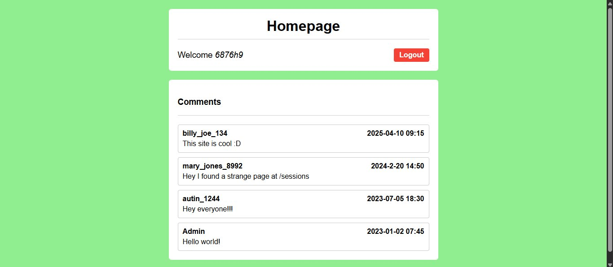
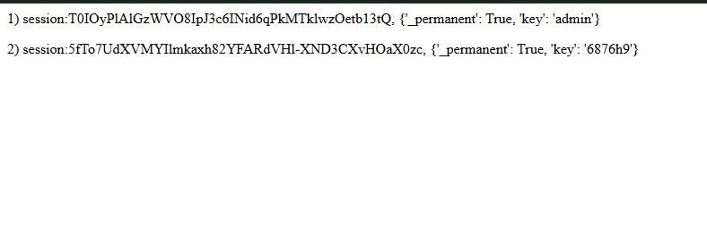
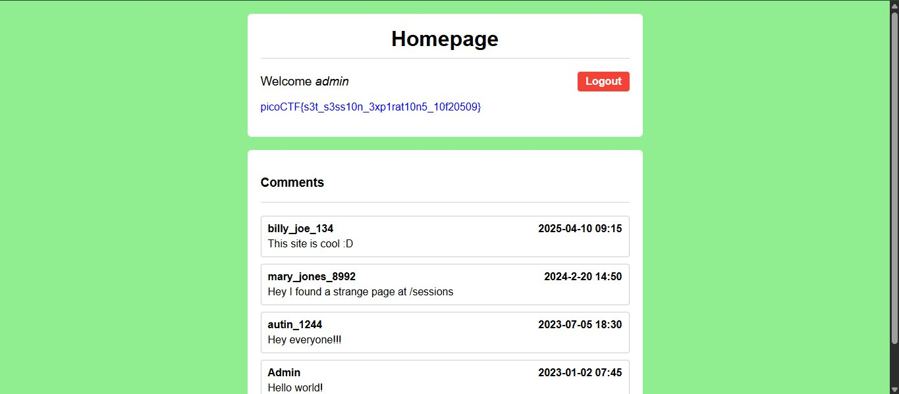

# picoCTF — Old Sessions

**Challenge Author:** David Gaviria  
**Solved by:** 6876h9  
**Category:** Web Exploitation  
**Difficulty:** Easy  
**Points:** Not disclosed  
**Status:** Solved

---

## Challenge Description

> Proper session timeout controls are critical for securing user accounts. If a user logs in on a public or shared computer but does not explicitly log out — instead simply closing the browser tab — and session expiration dates are misconfigured, the session may remain active indefinitely.
>
> This then allows an attacker using the same browser later to access the user's account without needing credentials, exploiting the fact that sessions never expire and remain authenticated.

**Hint provided:**
- Do you know how to use the web inspector?
- Where are cookies stored?

---

## Vulnerability Overview

This challenge demonstrates **improper session expiration**, a vulnerability catalogued under [OWASP A07:2021 — Identification and Authentication Failures](https://owasp.org/Top10/A07_2021-Identification_and_Authentication_Failures/).

When a web application sets `_permanent: True` on a session without enforcing a server-side expiration policy, session tokens remain valid indefinitely. If those session tokens are also exposed through an unprotected endpoint, an attacker can trivially hijack any active account — including privileged ones — without ever obtaining the account's credentials.

---

## Methodology

### Step 1 — Instance Launch and Initial Reconnaissance

The challenge instance was launched and the web application loaded. The landing page presented a login and registration interface.

A test account was registered under the username `6876h9` to gain authenticated access and observe how the application behaved from the inside.

**Screenshot — Homepage (authenticated as 6876h9):**



---

### Step 2 — Source Review and Lead Discovery

After logging in, the page's comment section was reviewed. One comment from the user `mary_jones_8992`, dated 2024-02-20, read:

> *"Hey I found a strange page at /sessions"*

This is a classic example of **information leakage through user-generated content**. The comment effectively disclosed an unauthenticated or improperly protected endpoint.

---

### Step 3 — Accessing the /sessions Endpoint

The `/sessions` path was navigated to directly. The endpoint returned a plaintext listing of all active sessions on the server:

```
1) session:T0IOyPlAlGzWVO8IpJ3c6INid6qPkMTklwzOetb13tQ, {'_permanent': True, 'key': 'admin'}
2) session:5fTo7UdXVMYIlmkaxh82YFARdVHl-XND3CXvHOaX0zc, {'_permanent': True, 'key': '6876h9'}
```

**Screenshot — /sessions endpoint output:**



This exposed two critical pieces of information:
- The session token associated with the `admin` account.
- Confirmation that both sessions were set to `_permanent: True` with no expiration enforced.

---

### Step 4 — Session Cookie Hijacking

The browser's Developer Tools were opened (F12), and the **Application** tab was navigated to, then **Cookies**.

The current `session` cookie value (corresponding to the `6876h9` account) was replaced with the `admin` session token retrieved from the `/sessions` endpoint:

```
T0IOyPlAlGzWVO8IpJ3c6INid6qPkMTklwzOetb13tQ
```

The page was refreshed. The application accepted the substituted cookie and authenticated the session as `admin` without any credential challenge.

**Screenshot — Admin session with flag:**



---

### Step 5 — Flag Captured

Upon successful session hijack, the application rendered the flag on the homepage under the admin account.

```
picoCTF{s3t_s3ss10n_3xp1rat10n5_10f20509}
```

> 

---

## Root Cause Analysis

| Issue | Detail |
|---|---|
| Exposed session store | `/sessions` endpoint publicly accessible with no authentication |
| Permanent sessions | All sessions configured with `_permanent: True` and no TTL |
| No server-side validation | Cookie substitution accepted without IP binding, fingerprinting, or re-authentication |
| Information leakage | A user comment on the homepage disclosed the endpoint path |

---

## Remediation

1. **Remove or protect the `/sessions` endpoint.** It should never be publicly accessible. If it exists for debugging purposes, restrict it to localhost or require administrative authentication.

2. **Enforce session expiration.** Sessions should have a defined TTL. Flask's `PERMANENT_SESSION_LIFETIME` configuration key controls this. A value of 15 to 30 minutes is appropriate for sensitive applications.

3. **Bind sessions to additional context.** Consider validating sessions against the originating IP address or user-agent to reduce the impact of token theft.

4. **Moderate user-generated content.** The endpoint was discovered through a comment on the public homepage. User comments disclosing internal paths should be flagged or removed.

---

## Tools Used

- Browser Developer Tools (Application > Cookies)
- Manual HTTP navigation

No automated tooling was required for this challenge.

---

## References

- [OWASP A07:2021 — Identification and Authentication Failures](https://owasp.org/Top10/A07_2021-Identification_and_Authentication_Failures/)
- [Flask Session Documentation](https://flask.palletsprojects.com/en/latest/quickstart/#sessions)
- [OWASP Session Management Cheat Sheet](https://cheatsheetseries.owasp.org/cheatsheets/Session_Management_Cheat_Sheet.html)

---

*Writeup by 6876h9*
